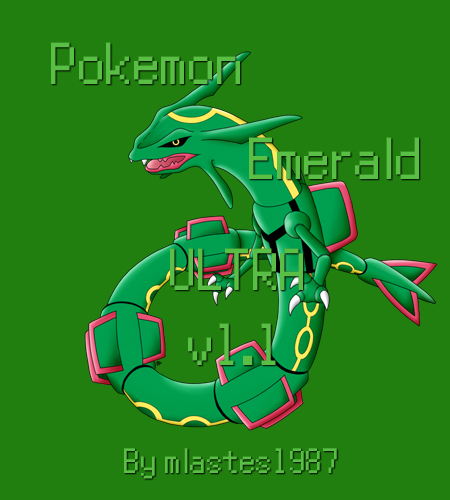

# Pokemon Emerald Ultra

Based on the pokeemerald-expansion from [**rh-hideout**](https://github.com/rh-hideout/pokeemerald-expansion)

# Features

- **All 382 Pokemon Obtainable** No trading necessary.

- **Gen 6 ORAS Dexnav** By setting flags 0x021, 0x022 and 0x023 to True you can use a port of the ORAS Gen 6 Dexnav.

- **Gen 6 Exp. Share and Exp System** Enabling Flag 0x264 to True or adding the EXP Share to your items through the Debug menu will distribute EXP points to your party.

- **Pokerider** From Gen 7 pressing R on locations of the Pokenav will allow you to fly to those locations.  Enabled by setting flag 0x020 to True

- **Changeable nicknames** Can be done through your Pokemon's Summary screen.

- **Changed starters** The new starters are Chimchar, Sobble and Grookey.

- **Reusable TMs**

- **Forgettable HMs** Without a Move Tutor.

- **Startup Money** Startup money has been changed from 3,000 to 35,000 Pokedollars.

- **HGSS Pokedex Plus** Backported from Gen 5 HeartGold SoulSilver, you get to enjoy the features of Pokedex Plus.

- **Follower Pokemon** Any Pokemon in the first party slot will follow you through the overworld.

- **Trade Evolutions** All Trade Evolutions can evolve by using either a Linking Cord, which is sold on the 2nd Floor of the Lilycove Department store, or their specific evolution items like Metal Coat or King's Rock.

- **Debug Menu** By pressing R+Start you can open a special debug menu made by a few people. [**See here**](/include/config/debug.h) and it includes features like giving you items, pokemon, and other changes to the game.

- **Double Battles** All double battles no longer require you to have two pokemon in your party and 25% of the time wild battles will be double.  This also means that you can battle two trainers at once.

- **Gen 5 Map Area Popups** All Map Area Popups are switched to Gen 5 and include a 12hr clock displayed at the bottom.

- **Running Indoors** This makes traversing all of the world much easier and faster, great for speed runs.

- **Fast-Run** During wild battles you can hold B to run.

- **Known Issues** Any known or reported issues will be put here.

# Thanks/Credits

Thanks to the [**RH-Hideout**](https://github.com/rh-hideout) community, whose help and Emerald Expansion code base made this project possible.
